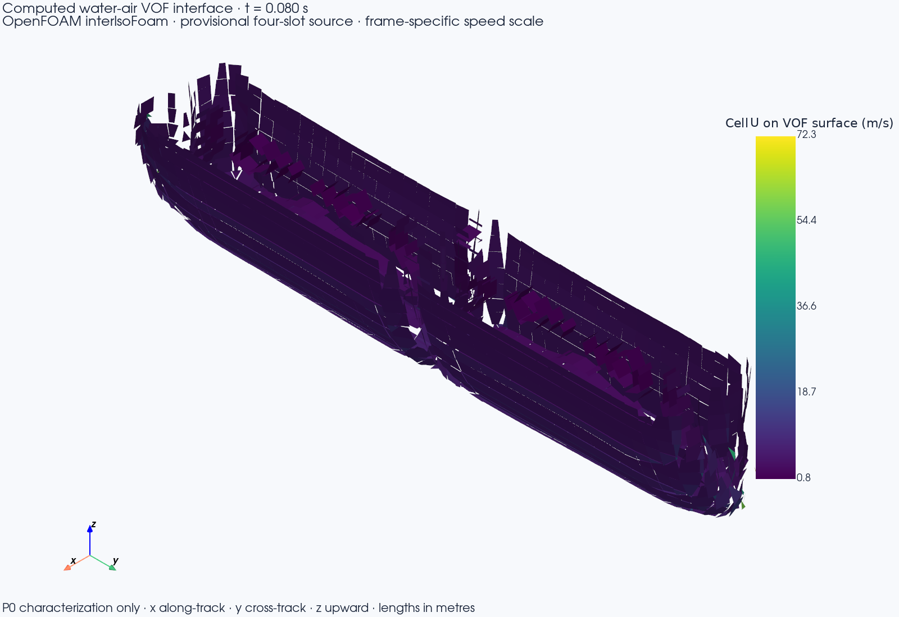

# P0 CPU VOF characterization result

**Decision:** solver and mesh execution completed, but this exploratory run
passes no scientific validation gate. The inventory discrepancy, Courant-limit
exceedances, three-cell slot resolution, and laminar high-Reynolds-number model
must be resolved or bounded before scaling the case.

## Run identity

- Run: `restas-cpu-vof-20260924T222240.919816Z-49f65225`
- Solver: OpenCFD OpenFOAM 2512 `interIsoFoam`, image ID
  `sha256:f5080db350a74a6130f248e2fd4d4fd1a8bd9309054b49ca160afe45a4d0c45b`
- Revision at launch: `5bee7e762775e2ada7b129cb83faf0a3f96feacd`; worktree was dirty.
- Inputs: 16 provisional 1.0 × 0.15 m slots in a 2×2 layout, 0.05 m gaps,
  4.8 m/s downward water velocity for 0.08 s, and 50 m/s opposing aircraft-frame
  crossflow. No measured Restás hardware properties were available.
- SI, water-air VOF, gravity, surface tension and all boundary assumptions are
  recorded in [`P0_RESTAS_CPU_VOF.md`](../experiments/P0_RESTAS_CPU_VOF.md).
  The run's input manifest SHA-256 is
  `fab9178ef25882fd0cf60d51e19598b0cb1758c09db6a2b6aaf53b848f17b777`.

## Execution evidence

The solver exited zero at 0.12 s. `checkMesh -allTopology -allGeometry` passed
for 2,081,200 all-hex cells. Each slot's 0.15 m short axis had only three cells.
The run used 16 MPI ranks within an 18-CPU Docker cap and 48 GiB memory limit;
wall time was 975.6 s. Docker's two-second samples recorded 5.551 GiB peak
memory and 1619.97% peak CPU. Throughput was 0.443 simulated seconds per wall
hour. Six geometric interface VTP snapshots span 0.02–0.12 s and total
1,095,369 bytes. Pressure-solver iteration counts were logged, but pressure
solve time share and filesystem I/O/checkpoint time share were not measured.

The maximum logged cumulative continuity error was 2.17e-7. The logged alpha
range reached -2.35e-9 to 1.0. Global Courant reached 0.5417 against the
configured 0.5 limit; interface Courant reached 0.2926 against 0.25. These
reported maxima exceeded the configured values even though the solver reached
its end time.

The alpha-water inventory plateaued at 0.231019355 m³ at 0.119177 s. The
intended rectangular source integral was 0.2304 m³ (230.4 kg), leaving
+0.000619355 m³ or +0.269%. The difference first appears across the timestep
that crosses the nominal 0.08 s shutoff. Per-slot liquid-flux histories were
not saved, so the exact injected mass and cause of the discrepancy are unknown.
No conservation tolerance was preregistered; this is diagnostic evidence, not a
pass or fail result.

## Computed view

The image is the solver's actual geometric VOF interface at 0.080 s. Its surface
cells are colored by cell-centered speed magnitude; the scale is specific to
this frame. It is not a resolved droplet field or a prediction for the built
device.

The image metadata and input/output hashes are in
[`P0_RESTAS_CPU_VOF_0p08s.json`](P0_RESTAS_CPU_VOF_0p08s.json). The raw run bundle
and full machine-readable report remain under the ignored path
`results/runs/restas-cpu-vof-20260924T222240.919816Z-49f65225/` on this
workstation.

## Limits and next gate

The assumed slot-width Reynolds numbers are approximately 7.2e5 for water and
5.1e5 for air; a laminar model cannot predict this breakup. There is no grid,
time-step, domain, or turbulence-model study, no aircraft body or wake, no
descent to ground, and no parcel transfer or ground scoring. Before a follow-on
CPU case, independently review and preregister the source-event profile and
ledger tolerance, save per-slot liquid fluxes, and keep logged Courant values
within their declared limits. Instrument pressure-solve and I/O cost before
extrapolating to a larger mesh. The full Rouaix manuscript is now available,
but E1 still requires independent curve digitization and a registered case;
see [`docs/STATUS.md`](../docs/STATUS.md).
